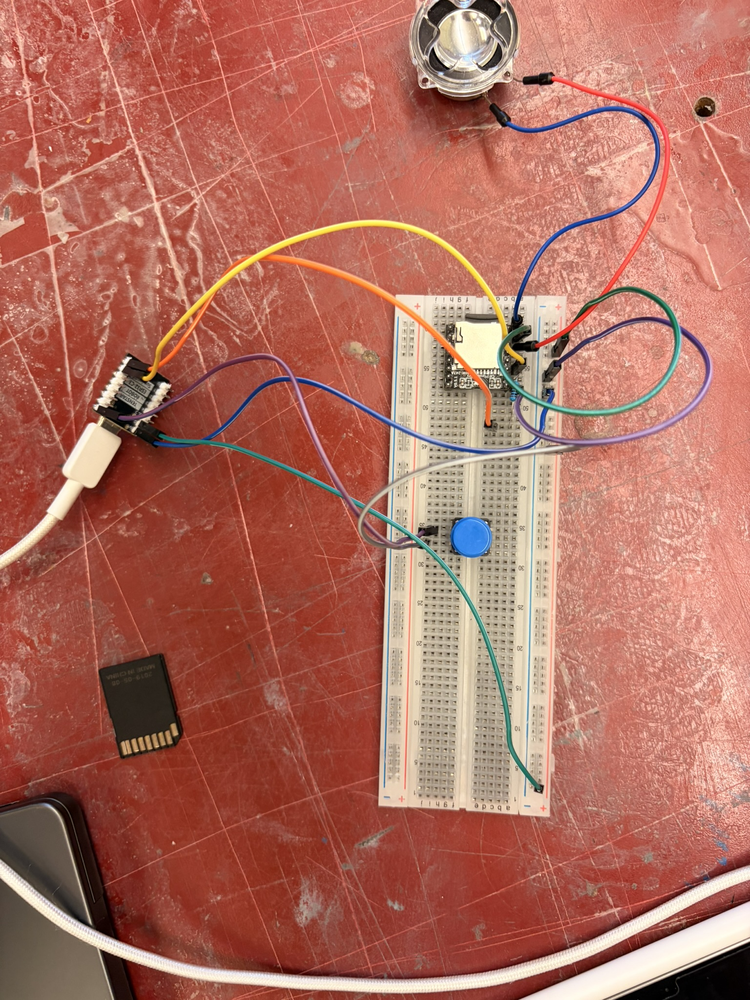
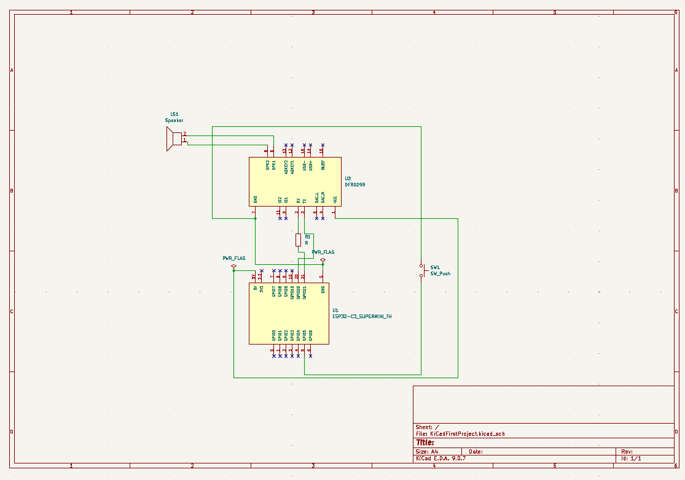
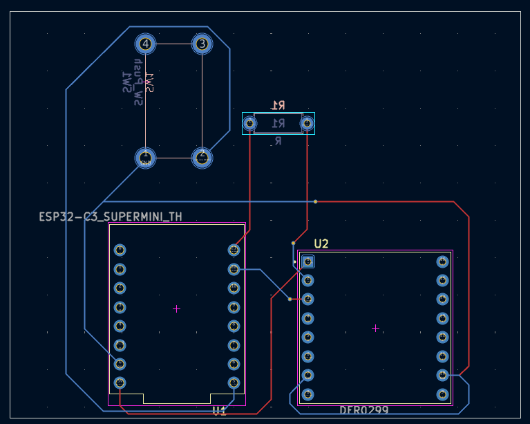
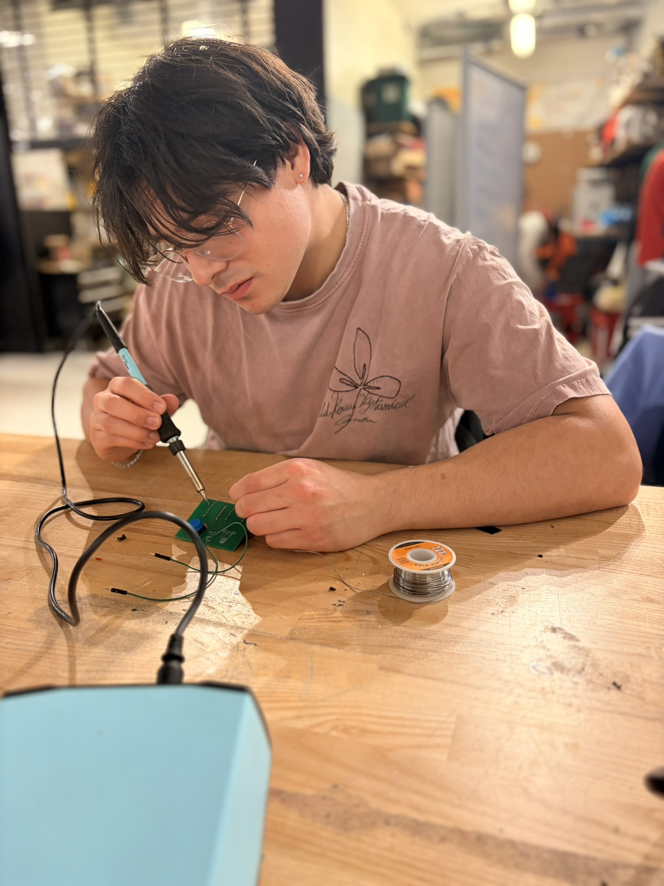
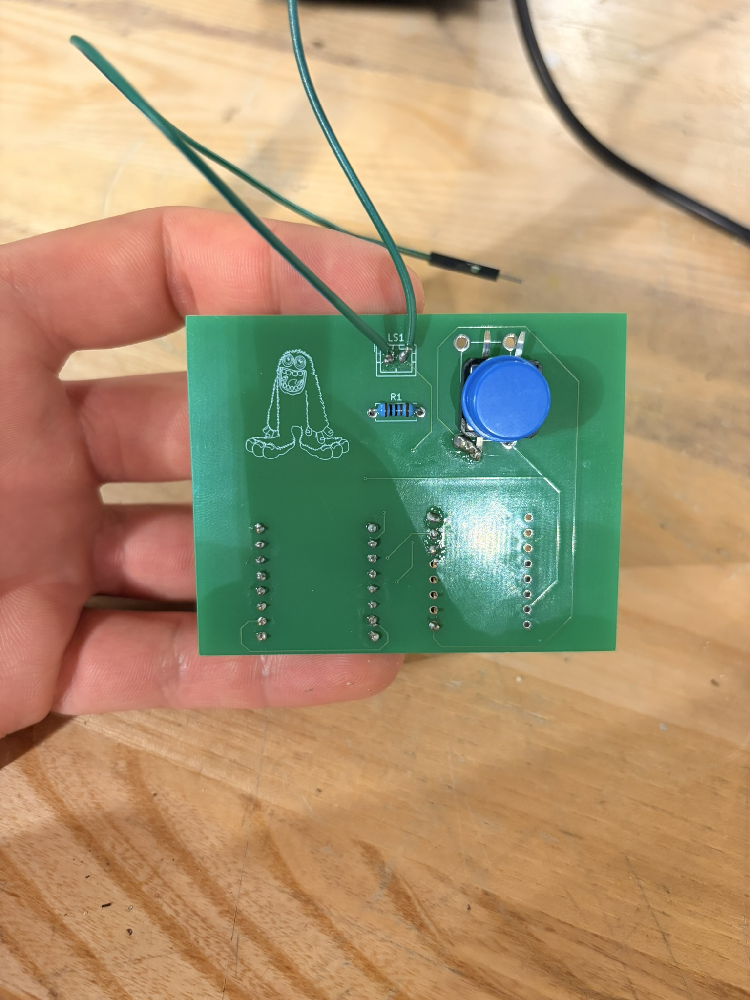

# ⚡ SD Card Audio Player PCB

Custom-designed ESP32-based audio playback system capable of playing audio tracks stored on an SD card through physical user button inputs.

---

## 📐 Overview

This project involved the complete development of an embedded audio playback system, progressing from breadboard prototyping to a custom-designed and physically assembled PCB.

An ESP32 was programmed in C++ using the Arduino IDE to process physical button inputs and control SD-card-based audio playback. The electrical circuit was first designed and tested on a breadboard before being transferred into a custom PCB using KiCad.

The final PCB was manufactured, manually soldered, assembled, and tested as a complete embedded system.

### Key Objectives

- Design a functional SD-card-based audio playback circuit
- Breadboard prototype and validate the circuit
- Program an ESP32 to control system behaviour
- Process user inputs through physical push buttons
- Implement audio playback using C++ and the Arduino IDE
- Develop a complete electrical schematic in KiCad
- Design and route a custom PCB
- Assemble and solder the manufactured PCB
- Test and debug the completed hardware and software

---

## 🛠️ Software & Tools

- KiCad
- Arduino IDE
- C++
- ESP32
- Breadboard prototyping
- Soldering equipment
- Digital multimeter
- Electronic components and wiring

---

## 🔌 Breadboard Prototyping

The circuit was initially assembled and tested on a breadboard before committing the design to a PCB.

This allowed the electrical connections, button inputs, ESP32 firmware, and audio playback functionality to be tested and debugged early in the development process.

  

---

## 💻 ESP32 Programming

The ESP32 served as the primary controller for the system.

Custom firmware was written in C++ using the Arduino IDE to:

- Read physical push-button inputs
- Process user commands
- Control audio playback
- Select audio tracks stored on the SD card
- Interface with the playback hardware
- Coordinate overall system behaviour
- Support hardware testing and debugging

---

## 🧾 PCB Schematic

Once the breadboard prototype was validated, the circuit was recreated as an electrical schematic in KiCad.

The schematic defined the electrical connections between the ESP32, audio playback components, user inputs, power connections, and supporting circuitry.

  

---

## 🖥️ PCB Design

The completed schematic was converted into a custom PCB layout in KiCad.

The PCB design process included:

- Assigning component footprints
- Component placement
- Routing signal traces
- Routing power connections
- Organizing board geometry
- Checking electrical connectivity
- Performing design-rule checks
- Preparing the board for manufacturing

  

---

## 🔧 PCB Assembly & Soldering

After the PCB was manufactured, the electrical components were manually installed and soldered onto the board.

The assembled board was then inspected, tested for electrical continuity, and connected to the ESP32 and other system components.

  

---

## ⚡ Completed PCB

The finished PCB provided a compact and permanent implementation of the original breadboard prototype.

The final system combined the custom PCB, ESP32 firmware, physical user controls, and SD-card-based audio playback into a functional embedded system.

  

---

## 🔄 Development Process

The project followed an end-to-end electronics development workflow:

1. Circuit concept and component selection
2. Breadboard prototyping
3. ESP32 firmware development
4. Button input integration
5. SD-card audio playback testing
6. KiCad schematic development
7. PCB component placement
8. PCB trace routing
9. Design-rule verification
10. PCB manufacturing
11. Manual soldering and assembly
12. Hardware/software debugging
13. Final system testing

---

## 🧠 Engineering Skills Demonstrated

- Embedded systems development
- ESP32 programming
- C++ / Arduino
- Circuit design
- Breadboard prototyping
- PCB schematic capture
- PCB layout and routing
- KiCad
- Electronic prototyping
- Soldering
- Hardware/software integration
- Electrical testing
- System debugging
- Design iteration

---

## ✅ Project Outcome

The project successfully progressed from an initial breadboard prototype to a custom-designed and physically assembled embedded system.

Developing the system required integrating circuit design, ESP32 programming, PCB schematic development, board layout, manufacturing, soldering, and hardware debugging. The completed project demonstrated the full electronics development process from initial prototyping through final hardware implementation.

---

## 📁 Repository Contents

| File / Folder | Description |
| ------------- | ----------- |
| `README.md` | Project overview and documentation |
| `KiCad/` | KiCad schematic and PCB design files |
| `Code/` | ESP32 firmware and Arduino code |
| `Images/` | Project development and assembly images |
| `Gerbers/` | PCB manufacturing files |
